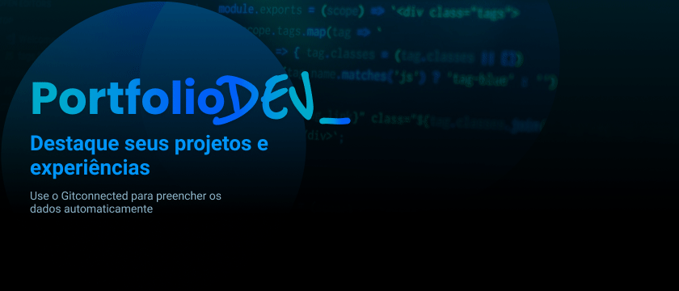
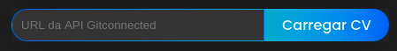
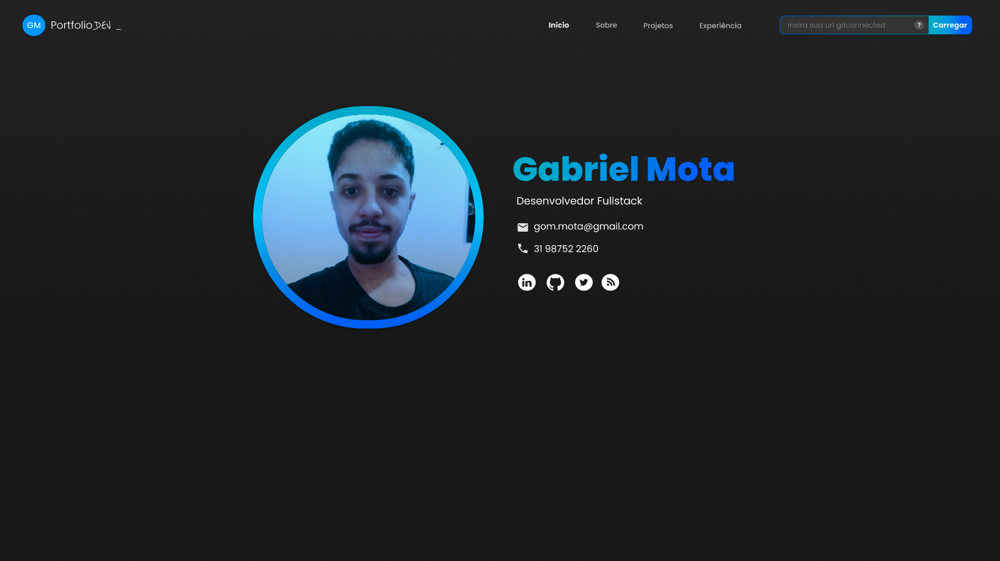
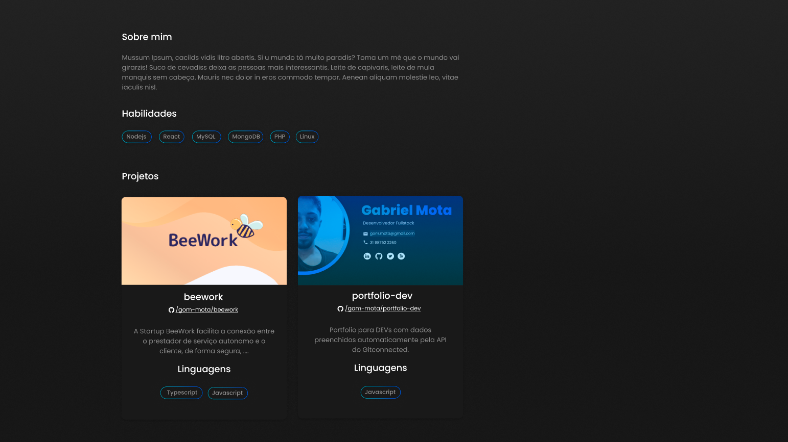
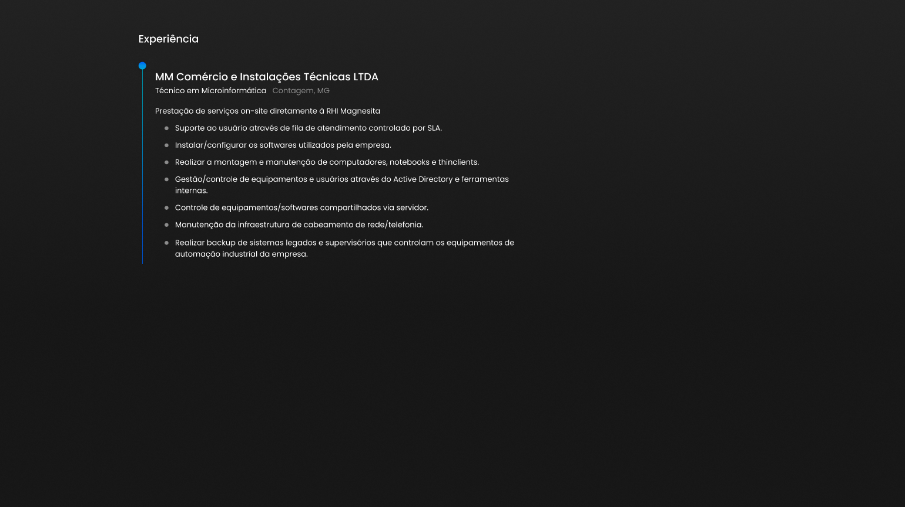
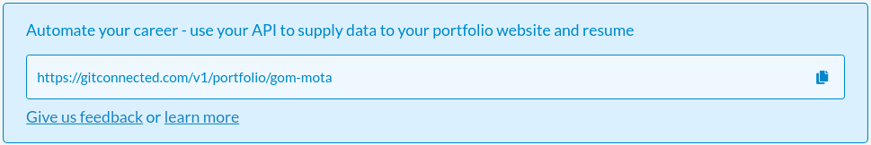
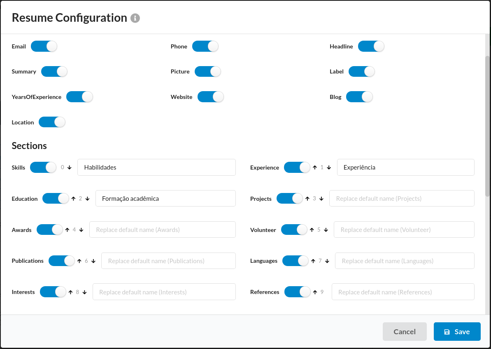

<p align='center'>

</p>

<p align='center'>
  <a href="http://internet.org/">
    
  </a>
  <a href="https://facebook.github.io/react">
    
  </a>
  
  
</p>


## Tópicos
* [Sobre](#sobre)
* [Capturas de Tela](#capturas-de-tela)
* [Gitconnected](#gitconnected)
* [Configuração](#configuração)
* [Personalização](#personalização)
* [Tecnologias](#tecnologias)
* [Pré-requisitos](#pré-requisitos)
* [Executar o projeto](#executar-o-projeto)
* [Deploy](#deploy)

## Sobre

Ter um portfólio online é muito importante para que as pessoas possam ver seu potencial de uma maneira mais detalhada.

>Em junho de 1986, um grupo de pesquisadores da Universidade Minnesota (EUA) realizaram um estudo e concluiram que as apresentações que utilizam recursos visuais são 43% mais persuasivas do que apresentações que não adotam tais recursos e que a capacidade de atenção, compreensão e retenção dos espectadores é aprimorada quando a apresentação utiliza suporte visual.

Com os arquivos desse projeto voce pode criar um site responsivo e intuitivo para expor:
* Detalhes pessoais.
* Informações de contato.
* Redes sociais.
* Habilidades.
* Projetos que estão no github.
* Experiência de carreira.

Para que seja possível adicionar/remover informações de forma simples, sem ter que fazer o _deploy_ da aplicação a cada mudança, o projeto utiliza a API do Gitconnected que permite realizar as alterações atualizando o site automaticamente.

:heavy_exclamation_mark: Caso queira visualizar rapidamente como o site ficaria com suas informações, voce pode acessar <a href="https://gommota.com">gommota.com</a> e utilizar o campo no menu superior para digitar o <a href="#gitconnected">link da API</a>.




## Capturas de Tela

<h5 align='center'>Veja o protótipo do site no botão abaixo</h5>
<p align='center'>
  <a href="https://www.figma.com/file/fynggxgyVWoczZRQV9UmEi/portfolio-dev?node-id=54%3A16">
    
  </a>
</p>
<p align='center'>  
  
  
  
</p>

## Gitconnected
<a href="https://gitconnected.com/">Acessar site</a>

O Gitconnected é um site criado com o objetivo de fornecer uma plataforma para que desenvolvedores e engenheiros de software compartilhem conhecimento, conectem, colaborem e aprendam.

No momento de criação do perfil no site, eles fornecem um link ûnico com sua API para que seja possível requisitar as informações em outra aplicação.

Exemplo:




Dados e seções suportados pelo perfil do Gitconnected:



- Note que no projeto não será listado todas as seções. irá ter apenas as que estão vísiveis nas <a href="#capturas-de-tela">capturas de tela</a>.

## Configuração

Para que o site apresente suas informações, mude o valor da variável em "**src/pages/index.js**".
```javascript
// Informe o link de sua API
const linkAPI="https://gitconnected.com/v1/portfolio/gom-mota";
```

- Na raiz do projeto encontra-se um exemplo da API em formato JSON. "**api.example.json**".

## Personalização
Caso queira personalizar as cores, fontes, efeitos, tamanho dos itens e ate mesmo criar uma nova variação de tema do site, voce pode ir até o arquivo "**src/styles/theme.js**" e fazer a alteração de acordo com seu gosto.

Exemplo:
```javascript
// Tema principal 
const Default = {
  colors: {
    background: "#171717",
    backgroundGradient: 'linear-gradient(to bottom, #222222, #1f1f1f, #1c1c1c, #1a1a1a, #171717);',
    card: "#191919",
    navMenuMobile: "#222222",
    primary: '#0095f9',
    textPrimary: '#e1e1e6',
    inputBackground: '#333333',
    textItem: "#ffffff",
    gradient: `linear-gradient(to right, #00a9ce, #00a6d5, #00a2dc, #009ee1, #0099e6, #0093eb, 
                #008cf0, #0085f3, #007bf8, #0070fc, #0065fe, #0057ff);`,
    gradientInverted: `linear-gradient(to right, #0057ff, #0065fe, #0070fc, #007bf8, #0085f3, #008cf0, 
                #0093eb, #0099e6, #009ee1, #00a2dc, #00a6d5, #00a9ce);`,
  },
  effects: {
    shadow: '0 0 3em #00000082',
  }
}

const SeuTema = {

}

export {Default, SeuTema}
```

Se optar por criar outro tema, ao invés de modificar o principal, voce deve realizar a alteração no arquivo "**src/pages/_app.js**" com o nome do novo tema.
```javascript
function MyApp({ Component, pageProps }) {
    return (
        <ThemeProvider theme={SeuTema}>
            <Component { ...pageProps } />
            <GlobalStyle />
        </ThemeProvider>
    )
}
```

## Tecnologias
* [Nextjs](https://nextjs.org/https://nextjs.org/)
* [React](https://facebook.github.io/react/)
* [Javascript](https://www.javascript.com/)

## Pré-requisitos

Verifique se os requisitos abaixo estão instalados antes de executar o projeto.

Clique no item para saber mais sobre o processo de instalação.

* [Git](https://git-scm.com/book/en/v2/Getting-Started-Installing-Git)
* [Nodejs](https://nodejs.org/pt-br/download/package-manager/)

## Executar o projeto
```bash
# Clone este repositório
$ git clone https://github.com/gom-mota/portfolio-dev.git

# Acesse a pasta do projeto no terminal/cmd
$ cd portfolio-dev

# Instale as dependências
$ npm install

# Iniciar o projeto em modo de desenvolvimento
$ npm run dev

# irá abrir uma página no navegador
```

## Deploy
Após realizar as modificações necessárias nos arquivos do projeto voce pode gerar um link operacional do site de forma simples através da Vercel. <a href="">Acesse a documentação</a>.

Exemplo: https://devportfolio-virid.vercel.app/

<p align='center'>Criado por <a href="https://gommota.com">Gabriel Mota</a>.</p>